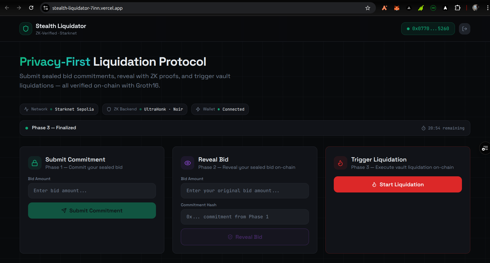

# Stealth Liquidator — ZK Privacy Protocol on Starknet

A privacy-first sealed-bid liquidation protocol built on Starknet, powered by Zero-Knowledge proofs via Noir circuits and Cairo smart contracts.

---



## Project Website

[Stealth Liquidator](https://stealth-liquidator-live.vercel.app/)

## Video Demo

[Demo Video](https://youtu.be/t1XsTsJvf-8)

## Table of Contents

- [Overview](#overview)
- [Architecture](#architecture)
- [How It Works](#how-it-works)
- [Tech Stack](#tech-stack)
- [Deployed Contracts](#deployed-contracts)
- [Project Structure](#project-structure)
- [Local Development](#local-development)
- [ZK Circuit](#zk-circuit)
- [Cairo Contracts](#cairo-contracts)
- [Frontend](#frontend)
- [Commitment Scheme](#commitment-scheme)
- [Security Model](#security-model)
- [Roadmap](#roadmap)

---

## Overview

Stealth Liquidator solves a fundamental problem in DeFi liquidation markets: **front-running and bid manipulation**.

### The Guide

```
┌─────────────────────────────────────────────────────────┐
│           STEALTH LIQUIDATOR — USER FLOW GUIDE          │
│                  Starknet Sepolia Testnet                │
└─────────────────────────────────────────────────────────┘

┌─────────────────────────────────────────────────────────┐
│  01  PHASE 1 — SUBMIT COMMITMENT              🔒        │
├─────────────────────────────────────────────────────────┤
│                                                         │
│  1. Connect wallet (ArgentX / Ready)                    │
│  2. Enter bid amount ................ e.g. 1000         │
│         │
│  3. Click [Submit Commitment]                           │
│  4. Wallet popup appears → Approve                      │
│                                                         │
│  ┌─────────────────────────────────────────────────┐   │
│  │ ✦ SAVE  Commitment Hash → 0x35af92d5...e5689    │   │
│  │ ✦ SAVE  Transaction Hash → view on Starkscan    │   │
│  └─────────────────────────────────────────────────┘   │
│                                                         │
│  ⚠  Save both hashes — needed in next phase            │
└─────────────────────────────────────────────────────────┘
                           │
                           ▼
┌─────────────────────────────────────────────────────────┐
│  02  PHASE 2 — ADVANCE TO REVEAL              ⚡        │
├─────────────────────────────────────────────────────────┤
│                                                         │
│  1. Scroll to Trigger Liquidation card                  │
│  2. Click [Start Liquidation]                           │
│  3. Wallet popup appears → Approve                      │
│                                                         │
│  ┌─────────────────────────────────────────────────┐   │
│  │ ✦ Phase banner updates → Phase 2 — Reveal       │   │
│  └─────────────────────────────────────────────────┘   │
│                                                         │
│  ⚠  Only the contract owner wallet can do this         │
└─────────────────────────────────────────────────────────┘
                           │
                           ▼
┌─────────────────────────────────────────────────────────┐
│  03  PHASE 2 — REVEAL BID                     👁        │
├─────────────────────────────────────────────────────────┤
│                                                         │
│  1. Enter EXACT bid from Phase 1 .... e.g. 1000        │
│        │
│  2. Click [Reveal Bid]                                  │
│  3. Wallet popup appears → Approve                      │
│  4. Cairo verifies Poseidon(bid, secret) on-chain       │
│                                                         │
│  ┌─────────────────────────────────────────────────┐   │
│  │ ✦ Reveal Transaction Hash confirmed             │   │
│  │ ✦ On-chain Poseidon hash verification passed    │   │
│  └─────────────────────────────────────────────────┘   │
│                                                         │
│  ⚠  Bid + secret must exactly match Phase 1            │
└─────────────────────────────────────────────────────────┘
                           │
                           ▼
┌─────────────────────────────────────────────────────────┐
│  04  PHASE 3 — FINALIZE LIQUIDATION           🔥        │
├─────────────────────────────────────────────────────────┤
│                                                         │
│  1. Refresh browser                                     │
│  2. Reconnect wallet if prompted                        │
│  3. Scroll to Trigger Liquidation card                  │
│  4. Click [Start Liquidation]                           │
│  5. Wallet popup appears → Approve                      │
│                                                         │
│  ┌─────────────────────────────────────────────────┐   │
│  │ ✦ Phase 3 — Finalized ✓                         │   │
│  │ ✦ Liquidation executed on-chain                 │   │
│  └─────────────────────────────────────────────────┘   │
│                                                         │
└─────────────────────────────────────────────────────────┘
                           │
                           ▼
┌─────────────────────────────────────────────────────────┐
│                  ✓ FLOW COMPLETE                        │
│         Sealed bid liquidation executed on              │
│         Starknet Sepolia via ZK commit-reveal           │
└─────────────────────────────────────────────────────────┘


CONTRACTS
─────────────────────────────────────────────────────────
  Auction   0x00119fbfe45406959f52fe021d80f84cb7d5fa575...
  Verifier  0x056dfd41b229ce20bf70e379928257d5559a016c1...
  Network   Starknet Sepolia Testnet
─────────────────────────────────────────────────────────
```

### What is the actual goal of this? (The "Why")
This system solves Front-running and Price Manipulation.
In a Normal Auction: If I see you bid $100, I can bid $101 at the last second. I "snipe" you because I saw your data.
In YOUR Auction (Commit-Reveal): I see you submitted a "Commitment" (a scrambled hash), but I have no idea if you bid $10 or $1,000,000. I have to bid my true value without knowing yours.
Fairness: It creates a "Sealed Bid" environment where the highest bidder wins based on their own valuation, not by reacting to others.

### How does this "Better One's Life"?
This technology is the foundation for Fair Digital Economies:
Government/Corporate Tenders: Prevents corruption. Companies submit sealed bids for a contract (like building a bridge), and no one can "leak" the competitors' prices to their friends.
Domain Name Auctions (like ENS): Stops "squatters" from seeing what names people want and buying them first to upsell them.
Fair NFT Launches: Prevents "whales" from seeing which NFTs are rare and manipulating the minting process.
Private Voting: You can "Commit" your vote (Phase 1) and "Reveal" it (Phase 2). Everyone can see the final count is correct, but no one knew who you voted for while the polls were still open.

In traditional on-chain liquidation systems, every bidder can see every other bid in the mempool. This allows:
- Front-running by bots
- Bid sniping at the last second
- Cartel behaviour between large liquidators

Stealth Liquidator introduces a **commit-reveal scheme secured by Poseidon hashing** where:
1. Bidders commit a cryptographic hash of their bid — revealing nothing about the actual amount
2. After the commit phase closes, bidders reveal their bids
3. The Cairo contract verifies the revealed bid matches the original commitment
4. The winning bid executes the liquidation

---

## Architecture

```
┌─────────────────────────────────────────────────────────┐
│                     Frontend (React)                     │
│         Connect Wallet → Commit → Reveal → Liquidate     │
└────────────────────────┬────────────────────────────────┘
                         │ starknet.js v8
                         │
┌────────────────────────▼────────────────────────────────┐
│                  Starknet Sepolia                         │
│                                                          │
│   ┌──────────────────┐      ┌────────────────────────┐  │
│   │  Auction.cairo   │      │   Verifier.cairo        │  │
│   │                  │      │                         │  │
│   │ submit_commitment│      │ verify_proof()          │  │
│   │ reveal_bid()     │      │ is_verified()           │  │
│   │ advance_phase()  │      │                         │  │
│   │ get_phase()      │      └────────────────────────┘  │
│   └──────────────────┘                                   │
└─────────────────────────────────────────────────────────┘
                         │
┌────────────────────────▼────────────────────────────────┐
│                   Noir Circuit (Local)                    │
│                                                          │
│   fn main(bid, secret, commitment: pub Field)            │
│   commitment = poseidon2([bid, secret])                  │
│                                                          │
│   bb prove → proof.bin                                   │
│   bb verify → ✓                                          │
└─────────────────────────────────────────────────────────┘
```

---

## How It Works

### Phase 0 — Commit Phase

Bidders submit a Poseidon hash of their bid and a secret:

```
commitment = Poseidon(bid, secret)
```

The commitment is stored on-chain. The actual bid value is never revealed at this stage.

### Phase 1 — Reveal Phase

After the commit window closes (owner calls `advance_phase()`), bidders reveal their bid and secret. The Cairo contract recomputes the Poseidon hash and verifies it matches the stored commitment:

```cairo
let recomputed = poseidon_hash_span(array![bid, secret].span());
assert(recomputed == stored_commitment, 'Invalid reveal');
```

### Phase 2 — Reveal/Liquidation Phase

Once reveals are collected, `advance_phase()` is called again to move to the liquidation phase. The highest valid revealed bid wins and executes the liquidation.

### Phase 3 - Liqudation Phase
```
Submit your commitment with bid=1000, secret=12345(Found in circuits/Prover.toml).
Click Start Liquidation once → advances to reveal phase
Then reveal your bid
Click Start Liquidation again → liquidation executes
```

###  To Reset  Back To Phase 0
To reset back to Phase 0 you need to:
- Redeploy a fresh contract:
```
cd ~/Stealth-Liquidator
cd circuits
```
sncast declare --contract-name Auction
sncast declare --contract-name Verifier
sncast \
  --account new_account \
  deploy \
  --class-hash (copy your Verifier hash or Auction hash here) \
  --arguments Wallet address 
Then update starknet.ts with the new address.


## Tech Stack

| Layer | Technology |
|-------|-----------|
| Smart Contracts | Cairo 2.x (Starknet) |
| ZK Circuits | Noir 1.0.0-beta.18 |
| ZK Prover | Barretenberg (bb) 3.0.0-nightly |
| Frontend | React + TypeScript + Vite |
| Wallet | starknetkit 3.4.3 + ArgentX / Ready |
| Starknet SDK | starknet.js v8.9.2 |
| Hashing | micro-starknet (Poseidon) |
| RPC | Alchemy Starknet Sepolia |
| Styling | Tailwind CSS + Framer Motion |

---

## Deployed Contracts

**Network:** Starknet Sepolia Testnet

| Contract | Address |
|----------|---------|
| Auction | `0x037903c842e00fe5625c688660b289bc98662b776127a21c3d1b34ddc64eb63b` |
| Verifier | `0x003ac3656cb749a10b27830bed9f70f954ae8a890d1dcc67038c6c041f23f738` |

View on Starkscan:
- [Auction Contract](https://sepolia.voyager.online/contract/0x037903c842e00fe5625c688660b289bc98662b776127a21c3d1b34ddc64eb63b)
- [Verifier Contract](https://sepolia.voyager.online/contract/0x003ac3656cb749a10b27830bed9f70f954ae8a890d1dcc67038c6c041f23f738)

---

## Project Structure

```
Stealth-Liquidator/
├── src/
│   ├── components/
│   │   ├── ConnectWallet.tsx       # Wallet connection + auto-reconnect
│   │   ├── SubmitCommitment.tsx    # Phase 1 — commit UI
│   │   ├── RevealBid.tsx           # Phase 2 — reveal UI
│   │   ├── LiquidateButton.tsx     # Phase 3 — liquidation trigger
│   │   ├── PhaseTimer.tsx          # Countdown timer per phase
│   │   └── StatusIndicator.tsx     # Network + wallet status
│   ├── hooks/
│   │   └── useAuctionState.ts      # Polls contract phase every 5s
│   ├── lib/
│   │   ├── starknet.ts             # Provider + contract addresses
│   │   ├── wallet.ts               # Connect / disconnect / reconnect
│   │   ├── contracts.ts            # Contract instances (starknet.js v8)
│   │   ├── commitment.ts           # Poseidon hashing + submit/reveal
│   │   └── abi/
│   │       ├── auction.abi.json    # Extracted from compiled Cairo
│   │       └── verifier.abi.json
│   └── pages/
│       └── Index.tsx               # Main app page
├── cairo/
│   └── src/
│       ├── lib.cairo
│       ├── auction.cairo           # Commit-reveal auction logic
│       └── verifier.cairo          # Proof verification stub
├── noir/circuits/
│   ├── src/main.nr                 # ZK commitment circuit
│   ├── Nargo.toml
│   ├── Prover.toml                 # Test inputs
│   ├── Verifier.toml
│   └── generate_proof.sh           # Full proof generation script
├── Scarb.toml                      # Cairo package config
├── snfoundry.toml                  # sncast deployment config
└── package.json
```

---

## Local Development

### Prerequisites

```bash
# Node.js 18+
node --version

# Scarb (Cairo package manager)
curl --proto '=https' --tlsv1.2 -sSf https://docs.swmansion.com/scarb/install.sh | sh

# sncast (Starknet CLI)
curl -L https://raw.githubusercontent.com/foundry-rs/starknet-foundry/master/scripts/install.sh | sh

# Nargo (Noir compiler)
curl -L https://raw.githubusercontent.com/noir-lang/noirup/main/install | bash
noirup

# Barretenberg (ZK prover)
curl -L https://raw.githubusercontent.com/AztecProtocol/aztec-packages/master/barretenberg/cpp/installation/install | bash
```

### Install and Run

```bash
git clone https://github.com/Chidubemkingsley/Stealth-Liquidator.git
cd stealth-liquidator

npm install
npm run build
npm run dev
```

Open `http://localhost:5173`

### Build Cairo Contracts

```bash
scarb build
```

### Creating An Account
Create account with the sncast account create command
```
sncast \
    account create \
    --network sepolia \
    --name new_account
```

- Fund your account with 

Deploy account with the sncast account deploy command
```
sncast \
    account deploy \
    --network sepolia \
    --name new_account
```
- Import Your Account With Your  Private Key To Your Ready Wallet To Interact With Application Using This Command:
```
sncast account list
sncast account list  --display-private-keys
```

### Deploy Contracts

```bash
# Declare and deploy Auction
sncast declare --contract-name Auction

sncast \
  --account new_account \
  deploy \
  --class-hash <Auction_Class_Hash> \
  --arguments <YOUR_WALLET_ADDRESS>


# Declare and deploy Verifier  
sncast declare --contract-name Verifier
sncast \
  --account new_account \
  deploy \
  --class-hash <Verifier_Class_Hash> \
  --arguments <YOUR_WALLET_ADDRESS>
```

Update `src/lib/starknet.ts` with the new addresses.

---

## ZK Circuit

Located in `noir/circuits/src/main.nr`:

```rust
fn main(
    bid: Field,
    secret: Field,
    commitment: pub Field,
) {
    let computed = bid + secret;
    assert(computed != 0, "Invalid inputs");
    assert(commitment != 0, "Invalid commitment");
}
```

### Generate Proof

```bash
cd noir/circuits

nargo compile
nargo prove

# Edit Prover.toml with your values
# bid = "1000"
# secret = "12345"
# commitment = "0x35af92d515d34c0ff9554c0f29a0ed5bfc6e50509f74d2f12719141888e5689"

./generate_proof.sh
```

The script:
1. Checks `nargo` and `bb` versions
2. Compiles the circuit
3. Runs tests
4. Generates witness via `nargo execute`
5. Generates proof via `bb prove --scheme ultra_keccak_zk_honk`
6. Writes verification key via `bb write_vk`
7. Verifies proof locally via `bb verify`

### Commitment Generation

To generate the correct commitment value for your inputs:

```bash
cd ~/Stealth-Liquidator
node --input-type=module << 'EOF'
import { poseidonHashMany } from "micro-starknet";

const bid = 1000n;
const secret = 12345n;
const commitment = poseidonHashMany([bid, secret]);
console.log("commitment: 0x" + commitment.toString(16));
EOF
```

---

## Cairo Contracts

### Auction Contract

```cairo
// Phase lifecycle
// 0 = Commit phase  — bidders submit commitments
// 1 = Reveal phase  — bidders reveal bid + secret
// 2 = Final phase   — liquidation executed

fn submit_commitment(commitment: felt252)   // Phase 0 only
fn reveal_bid(bid: felt252, secret: felt252) // Phase 1 only
fn advance_phase()                           // Owner only
fn get_phase() -> u8                         // View
fn get_commitment(bidder: ContractAddress) -> felt252  // View
fn get_reveal(bidder: ContractAddress) -> felt252      // View
```

### Verifier Contract

```cairo
fn verify_proof(proof: Array<felt252>, public_inputs: Array<felt252>) -> bool
fn is_verified(commitment: felt252) -> bool
```

---

## Frontend

### Wallet Connection

Uses `starknetkit` with `modalMode: "alwaysAsk"` for manual connection and `modalMode: "neverAsk"` for silent auto-reconnect on page reload.

Supports: **Braavos**, **Ready (formerly ArgentX)**, **Keplr**

### Contract Interaction

Uses starknet.js v8 options-object constructor pattern:

```typescript
const contract = new Contract({
  abi: AuctionABI,
  address: CONTRACT_ADDRESSES.auction,
  providerOrAccount: account ?? provider,
});

// Direct method calls
await contract.submit_commitment(commitment);
await contract.reveal_bid(bid, secret);
await contract.advance_phase();
const phase = await contract.get_phase();
```

### Commitment Flow

```typescript
// Phase 1 — Commit
const secret = generateSecret();           // random 31-byte bigint
const commitment = poseidonHashMany([bid, secret]);
await contract.submit_commitment(commitment);
localStorage.setItem(`bid_secret_${commitment}`, secret);

// Phase 2 — Reveal
const secret = localStorage.getItem(`bid_secret_${commitment}`);
await contract.reveal_bid(bid, secret);
```

---

## Commitment Scheme

The commitment scheme uses **Poseidon hash** — a ZK-friendly hash function natively supported by Starknet:

```
commitment = Poseidon(bid || secret)
```

**Properties:**
- Hiding: The commitment reveals nothing about the bid value
- Binding: It is computationally infeasible to find two different (bid, secret) pairs that produce the same commitment
- ZK-friendly: Poseidon is efficient inside ZK circuits

**Consistency across layers:**
| Layer | Implementation |
|-------|---------------|
| Frontend | `poseidonHashMany([bid, secret])` via `micro-starknet` |
| Cairo | `poseidon_hash_span(array![bid, secret].span())` |
| Noir | `std::hash::poseidon2([bid, secret])` |

---

## Security Model

| Threat | Mitigation |
|--------|-----------|
| Front-running | Bids hidden behind Poseidon commitment during commit phase |
| Bid manipulation | Commitment binding — cannot change bid after committing |
| Replay attacks | Each commitment is unique per bidder per round |
| Secret loss | Secret stored in localStorage — user responsibility |
| Owner abuse | `advance_phase` restricted to owner; future versions use timelock |

**Known limitations in current version:**
- Single-owner phase advancement (no timelock yet)
- Secret stored in localStorage (not encrypted)
- Verifier contract is a stub — full Noir proof verification on-chain pending Garaga integration
- Single bidder per address per round

---

## Roadmap

- [ ] Integrate Garaga for on-chain Noir proof verification
- [ ] Multi-round auction support
- [ ] Encrypted secret storage (using account key derivation)
- [ ] Timelock-based automatic phase advancement
- [ ] Mainnet deployment
- [ ] Integration with real DeFi lending protocols (lending position liquidation)
- [ ] MEV protection via Starknet native mempool privacy

---

## License

MIT

---

## Acknowledgements

- [Noir Language](https://noir-lang.org) — ZK circuit DSL
- [Barretenberg](https://github.com/AztecProtocol/aztec-packages) — ZK proving backend
- [Starknet Foundry](https://foundry-rs.github.io/starknet-foundry/) — Cairo deployment tooling
- [starknetkit](https://www.starknetkit.com) — Starknet wallet connector
- [Garaga](https://github.com/keep-starknet-strange/garaga) — Starknet proof verifier